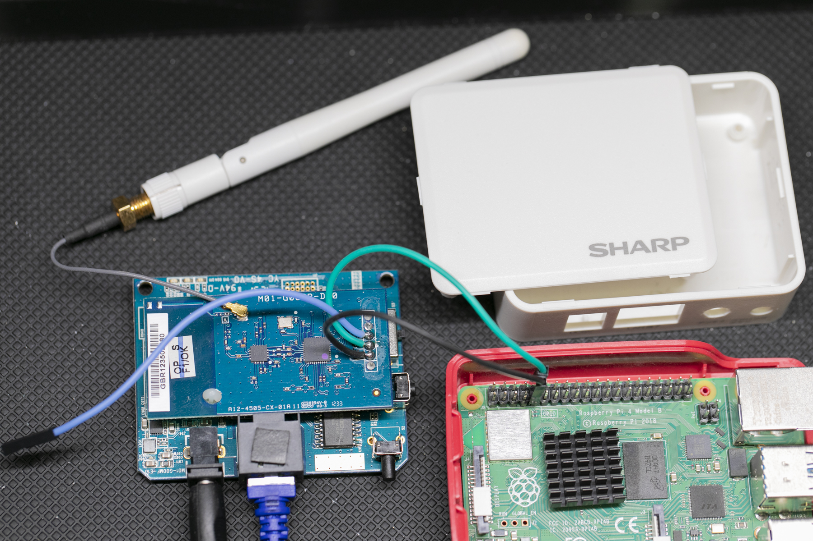
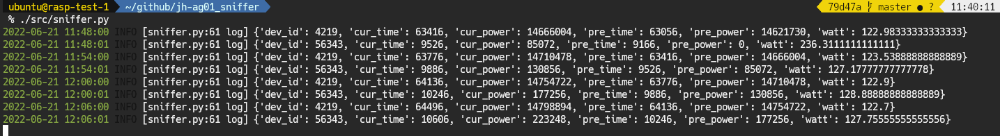

# SHARP HEMS Sniffer

## 概要

シャープの HEMS コントローラ JH-AG01 の内部通信を読み取って，電力センサーの計測値を取得するスクリプトです．



## 準備

JH-AG01 を分解し，写真のようにコネクタターミナルから線だしを行い，Raspbeery Pi 等の UART 端子と接続します．

線だしするのは以下の端子になります．

| 端子                 | 信号名    |
|:---------------------|:----------|
| LANコネクタ側から2番目| GND      |
| LANコネクタ側から4番目| TX [^1]  |

[^1]: 基板上のシルクは Zigbee モジュール視点で書かれています．

## ライブラリのインストール

```
sudo apt install python3-serial
sudo apt install python3-coloredlogs
sudo apt install python3-fluent-logger # Fluentd への送信機能を使う場合
```

## 使い方

シリアルポートが `/dev/ttyAMA0` の場合，下記のようにします．

```
python3 src/sniffer.py /dev/ttyAMA0
```

実行してからしばらくすると，HEMS コントローラが収集したデータが下図のように表示されます．



値の意味は下記のとおりです．

| ラベル    | 内容                                            |
|:----------|:------------------------------------------------|
| dev_id    | デバイスID (プラグ個体値)                       |
| cur_time  | 現在の時刻(秒, 0xFFFF になると 0に戻ります)     |
| cur_power | 現在の積算電力(0xFFFFFFFF になると 0に戻ります) |
| pre_time  | 前回の時刻(秒, 0xFFFF になると 0に戻ります)     |
| pre_power | 前回の積算電力(0xFFFFFFFF になると 0に戻ります) |
| watt      | 前回と現在の時刻と積算電力から計算した平均電力  |

データの収集は6分間隔で行われるようなので，時刻は 240 づつ増加します．

## ヒント

HEMS コントローラの IP アドレスにアクセスすると，Web インターフェースを表示できます．ID，パスワード共に root でログインできます．

接続されているコンセントや動作ログ等が確認できるので便利です．
